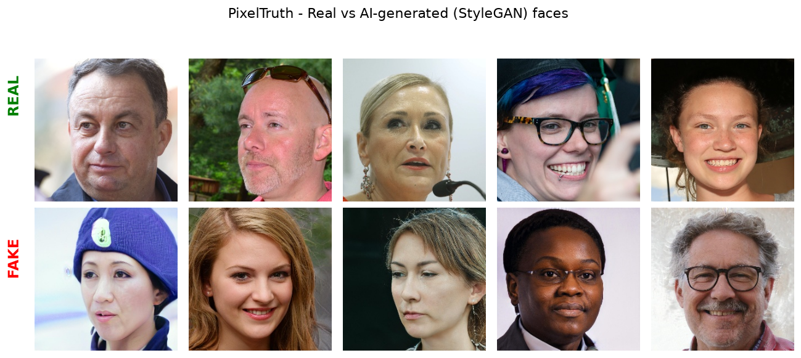
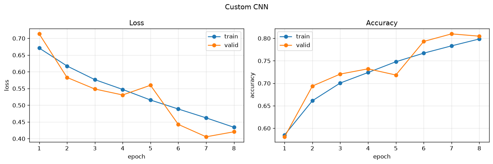
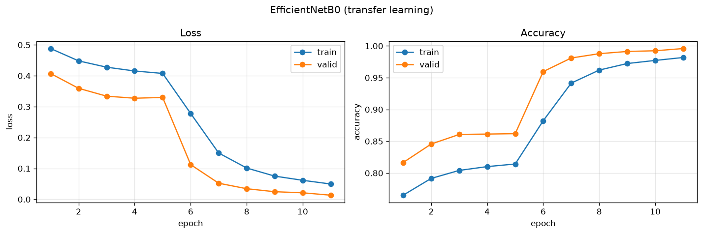
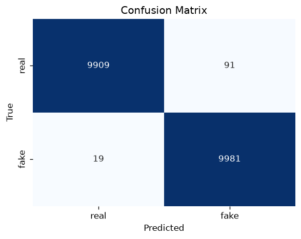
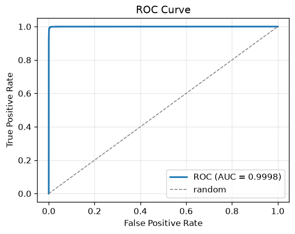
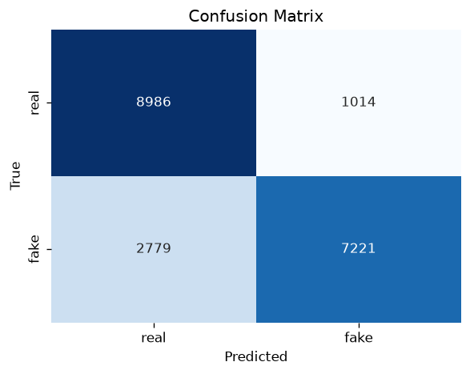
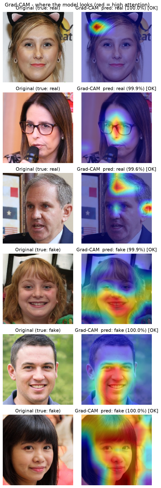
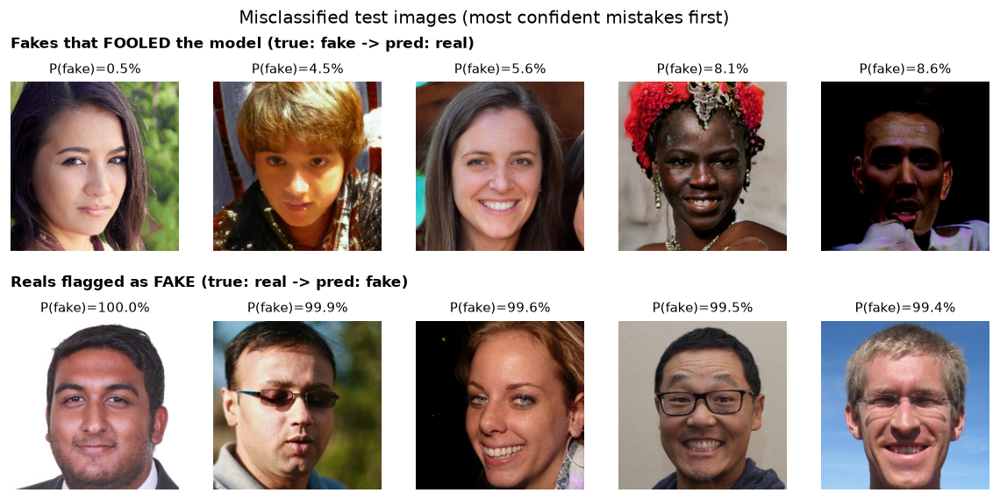

# 🕵️ PixelTruth — Deepfake Face Detection

> An end-to-end deep learning system that detects whether a human face image is **Real** or **AI-generated (deepfake)**. Built with PyTorch using a custom CNN baseline and **EfficientNetB0 transfer learning**, reaching **99.45% test accuracy** and **0.9998 ROC-AUC** on 20,000 held-out images.

---

## 📌 Table of Contents
1. [Overview](#-overview)
2. [Results at a Glance](#-results-at-a-glance)
3. [Dataset](#-dataset)
4. [Project Structure](#-project-structure)
5. [Pipeline & Architecture](#-pipeline--architecture)
6. [Model Architectures](#-model-architectures)
7. [Training Details](#-training-details)
8. [Training Results (per-epoch)](#-training-results-per-epoch)
9. [Evaluation Results](#-evaluation-results)
10. [Grad-CAM Interpretability](#-grad-cam-interpretability)
11. [Misclassification Analysis](#-misclassification-analysis)
12. [How to Run](#-how-to-run)
13. [Demo App](#-demo-app)
14. [Deployment Notes](#-deployment-notes)
15. [Limitations](#-limitations)
16. [Tech Stack](#-tech-stack)

---

## 🔎 Overview

Generative models like **StyleGAN** can now produce human faces that are almost
indistinguishable from real photos. **PixelTruth** is a binary image classifier
that tells real faces apart from AI-generated ones.

The project is a complete pipeline:

- **Data exploration** → counts, sample grid, size/channel checks
- **Preprocessing** → resize, ImageNet normalization, train-only augmentation
- **Two models** → a CNN from scratch (baseline) and EfficientNetB0 (transfer learning)
- **Training engine** → mixed precision (AMP), 2-phase fine-tuning, callbacks
- **Evaluation** → accuracy, precision/recall/F1, confusion matrix, ROC/AUC
- **Interpretability** → Grad-CAM heatmaps of what the model looks at
- **Error analysis** → which fakes fooled the model and which reals were false alarms
- **Demo** → a Streamlit web app for drag-and-drop prediction

---

## 🏆 Results at a Glance

| Model | Test Accuracy | ROC-AUC | F1 (macro) |
|-------|:-------------:|:-------:|:----------:|
| Custom CNN (from scratch) | 81.04% | 0.9035 | — |
| **EfficientNetB0 (transfer learning)** | **99.45%** | **0.9998** | **0.9945** |

Transfer learning gives a **+18.4% absolute accuracy** jump over the scratch CNN.

---

## 📂 Dataset

**[140k Real and Fake Faces](https://www.kaggle.com/datasets/xhlulu/140k-real-and-fake-faces)** (Kaggle)

- **70,000 real** faces (Flickr / NVIDIA FFHQ)
- **70,000 fake** faces (generated by **StyleGAN**)
- Pre-split into train / valid / test

| Split | Images | Real | Fake |
|-------|:------:|:----:|:----:|
| Train | 100,000 | 50,000 | 50,000 |
| Valid | 20,000 | 10,000 | 10,000 |
| Test  | 20,000 | 10,000 | 10,000 |
| **Total** | **140,000** | **70,000** | **70,000** |

- All images are **256×256 RGB**, perfectly class-balanced.
- **Label convention used in code:** `real = 0`, `fake = 1` (so *fake* is the positive class — "deepfake detected").

**Sample images (real vs fake):**



---

## 🗂 Project Structure

```
PixelTruth/
├── src/
│   ├── config.py        # all settings/hyperparameters in one place
│   ├── data.py          # ImageFolder loaders, transforms, label remap
│   ├── models.py        # Custom CNN + EfficientNetB0 builders
│   ├── train.py         # training engine (AMP, callbacks, 2-phase)
│   ├── evaluate.py      # test metrics, confusion matrix, ROC/AUC
│   ├── gradcam.py       # Grad-CAM heatmaps
│   ├── misclassify.py   # error analysis
│   ├── explore.py       # dataset exploration
│   └── utils.py         # seed, device info, plots
├── app.py               # Streamlit demo (run: python app.py)
├── model/
│   └── pixeltruth_efficientnet.pt   # trained weights (99.45% test acc)
├── outputs/             # generated plots & figures
├── requirements.txt
└── README.md
```

---

## 🧪 Pipeline & Architecture

```
Raw image (256×256 RGB)
   ↓  Resize → 224×224
   ↓  ToTensor [0,1] → ImageNet normalize
   ↓  (train only) RandomHorizontalFlip, RandomRotation(±10°), ColorJitter
   ↓
EfficientNetB0 backbone (ImageNet pretrained)
   ↓
Custom binary head → single logit
   ↓
Sigmoid → P(fake) → threshold 0.5 → Real / Fake
```

> **Note on augmentation:** deepfake cues live in fine skin texture / high-frequency
> noise, so we deliberately avoid aggressive blur/denoise and use only mild,
> texture-preserving augmentations.

---

## 🧠 Model Architectures

### Option A — Custom CNN (baseline)

```
Input (3×224×224)
 → Conv(32)  + BatchNorm + ReLU + MaxPool
 → Conv(64)  + BatchNorm + ReLU + MaxPool
 → Conv(128) + BatchNorm + ReLU + MaxPool
 → GlobalAveragePooling
 → Dense(256) + ReLU + Dropout(0.5)
 → Dense(1)  (logit)
```
≈ **127K** parameters.

### Option B — EfficientNetB0 (transfer learning) ⭐

- **Backbone:** `EfficientNetB0`, pretrained on ImageNet
- **New head:** `Dropout(0.3) → Linear(1280, 128) → ReLU → Dropout(0.3) → Linear(128, 1)`
- **Phase 1 — feature extraction:** freeze the whole backbone, train only the head
- **Phase 2 — fine-tuning:** unfreeze the **last 30 layers**, train with a low LR; BatchNorm layers kept frozen (so running stats are not corrupted)

| Phase | Total params | Trainable params |
|-------|:------------:|:----------------:|
| Phase 1 (head only) | 4.17M | ~164K |
| Phase 2 (fine-tune) | 4.17M | ~4.13M |

---

## ⚙️ Training Details

| Setting | Value |
|---------|-------|
| Image size | 224 × 224 |
| Batch size | 32 |
| Loss | `BCEWithLogitsLoss` |
| Optimizer | Adam |
| LR — head (Phase 1) | 1e-3 |
| LR — fine-tune (Phase 2) | 1e-5 |
| Epochs | 5 (head) + up to 10 (fine-tune) |
| Mixed precision | AMP (`torch.autocast` + `GradScaler`) |
| EarlyStopping | patience 5, restore best weights |
| ReduceLROnPlateau | factor 0.5, patience 3 |
| Checkpoint | best `val_loss` saved |
| Normalization | ImageNet mean/std |
| Seed | 42 |
| Hardware | NVIDIA RTX 3050 Laptop GPU (CUDA 12.4) |
| Speed | ~0.04 s/batch; ~2 min/epoch (head), ~3.5 min/epoch (fine-tune) |

---

## 📈 Training Results (per-epoch)

### Custom CNN (8 epochs)

| Epoch | Train Loss | Train Acc | Val Loss | Val Acc |
|:-----:|:----------:|:---------:|:--------:|:-------:|
| 1 | 0.6710 | 58.50% | 0.7134 | 58.09% |
| 2 | 0.6173 | 66.12% | 0.5831 | 69.38% |
| 3 | 0.5765 | 70.06% | 0.5485 | 72.05% |
| 4 | 0.5472 | 72.40% | 0.5307 | 73.21% |
| 5 | 0.5156 | 74.79% | 0.5597 | 71.84% |
| 6 | 0.4887 | 76.70% | 0.4426 | 79.31% |
| **7** | 0.4622 | 78.32% | **0.4056** | **80.99%** ⭐ |
| 8 | 0.4340 | 79.86% | 0.4206 | 80.48% |



### EfficientNetB0 — Phase 1: Feature Extraction (base frozen, 5 epochs)

| Epoch | Train Loss | Train Acc | Val Loss | Val Acc |
|:-----:|:----------:|:---------:|:--------:|:-------:|
| 1 | 0.4882 | 76.51% | 0.4073 | 81.65% |
| 2 | 0.4482 | 79.15% | 0.3594 | 84.56% |
| 3 | 0.4278 | 80.41% | 0.3340 | 86.07% |
| 4 | 0.4155 | 81.01% | 0.3273 | 86.13% |
| 5 | 0.4076 | 81.42% | 0.3299 | 86.19% |

### EfficientNetB0 — Phase 2: Fine-Tuning (top unfrozen, low LR)

| Epoch | Train Loss | Train Acc | Val Loss | Val Acc |
|:-----:|:----------:|:---------:|:--------:|:-------:|
| 1 | 0.2780 | 88.23% | 0.1124 | 95.96% |
| 2 | 0.1500 | 94.15% | 0.0522 | 98.10% |
| 3 | 0.1014 | 96.20% | 0.0344 | 98.78% |
| 4 | 0.0752 | 97.23% | 0.0247 | 99.13% |
| 5 | 0.0616 | 97.72% | 0.0212 | 99.24% |
| **6** | 0.0496 | 98.18% | **0.0134** | **99.59%** ⭐ |



> **No overfitting:** validation accuracy stays *higher* than training accuracy
> (training is harder due to augmentation + active dropout), and validation loss
> decreases monotonically. Most importantly, the held-out **test** accuracy
> (99.45%) ≈ best **val** accuracy (99.59%) — the model generalizes.

---

## ✅ Evaluation Results

Final evaluation on the **20,000-image test set** (never seen during training).

### EfficientNetB0

```
Accuracy:  0.9945
ROC-AUC:   0.9998

              precision    recall  f1-score   support
        real     0.9981    0.9909    0.9945     10000
        fake     0.9910    0.9981    0.9945     10000
    accuracy                         0.9945     20000
   macro avg     0.9945    0.9945    0.9945     20000
weighted avg     0.9945    0.9945    0.9945     20000
```

**Confusion Matrix** &nbsp;|&nbsp; **ROC Curve**
:--:|:--:
 | 

|              | Pred real | Pred fake |
|--------------|:---------:|:---------:|
| **True real** | 9909 | 91 |
| **True fake** | 19 | 9981 |

- Only **110 / 20,000** images misclassified (**0.55%** error rate).
- **Fake recall = 99.81%** — the detector rarely lets a fake slip through.

### Custom CNN (baseline)

```
Accuracy:  0.8104
ROC-AUC:   0.9035
```



---

## 🔥 Grad-CAM Interpretability

Grad-CAM shows **where** the model looks when deciding real vs fake (red = high attention).



**Observed pattern:**
- **Real faces** → attention spreads to the **periphery** (hair, glasses, background).
- **Fake (StyleGAN) faces** → attention concentrates on the **central face** —
  cheeks, nose, mouth and the **hair–skin boundary**, exactly where StyleGAN
  tends to leave texture artifacts.

This confirms the model learned **meaningful, texture-based features** rather than
memorizing — a strong signal of genuine generalization.

---

## 🔬 Misclassification Analysis

Of the 110 errors on the test set:

| Error type | Count | What they look like |
|------------|:-----:|---------------------|
| Fakes that **fooled** the model (fake → real) | 19 | Very clean, high-quality StyleGAN faces or odd lighting |
| Reals **flagged** as fake (real → fake) | 91 | Clean, posed studio-style portraits |



**Insight:** the model is **biased toward "fake"** (91 false alarms vs only 19 missed
fakes). For a deepfake *detector* this is a desirable bias — it is safer to
over-flag a suspicious real than to let a real fake pass undetected.

---

## ▶️ How to Run

### 1. Setup

```bash
# create & activate a virtual environment
python -m venv venv
venv\Scripts\activate          # Windows
# source venv/bin/activate     # Linux/Mac

pip install -r requirements.txt
```

> Place the dataset under `datasets/real-vs-fake/` with `train/`, `valid/`, `test/`
> sub-folders (each containing `real/` and `fake/`).

### 2. Explore the data
```bash
python -m src.explore
```

### 3. Train
```bash
python -m src.train --model custom          # baseline CNN
python -m src.train --model efficientnet    # transfer learning (2 phases)
```

### 4. Evaluate
```bash
python -m src.evaluate --model efficientnet
```

### 5. Interpret & analyze
```bash
python -m src.gradcam --per-class 3
python -m src.misclassify --per-group 5
```

---

## 🖥 Demo App

A **Streamlit** web app: upload a face image → get **Real / Fake + confidence**,
with an optional **Grad-CAM** overlay.

```bash
python app.py
```

Then open **http://localhost:8501** in your browser.

> Run it with `python app.py` (not `streamlit run app.py`). On Windows + Python 3.13,
> Streamlit's server exits immediately under the default event loop; `app.py`
> applies the correct event-loop fix and re-launches itself through Streamlit.

---

## 🚀 Deployment Notes

The app deploys cleanly to **Streamlit Community Cloud** or **Hugging Face Spaces**
(both Linux). On those platforms the standard `streamlit run app.py` is used —
`app.py` detects it is already inside the Streamlit runtime and renders directly,
so the Windows-only fix is skipped automatically.

Two things to adjust for cloud deployment:
1. **CPU PyTorch** — `requirements.txt` pins the CUDA build (`torch==2.6.0+cu124`)
   for local GPU training. Cloud runners are CPU-only, so use a plain `torch`
   (and `torchvision`) without the `+cu124` suffix for deployment.
2. **Model weights** — `model/pixeltruth_efficientnet.pt` (~17 MB) must be present
   in the deployment (committed to the repo or pulled from a model host).

---

## ⚠️ Limitations

- All **fake** images come from **StyleGAN**. Accuracy on fakes from *other*
  generators (e.g. diffusion models, newer GANs) may be lower — the 99% figure is
  specific to this distribution.
- Trained on 256×256 face crops; very different resolutions, heavy compression, or
  non-frontal faces are out of distribution.
- The model is intentionally biased toward flagging "fake" (see error analysis).

---

## 🛠 Tech Stack

- **Python**, **PyTorch**, **torchvision**
- **scikit-learn** (metrics), **matplotlib**, **seaborn** (plots)
- **pytorch-grad-cam** (interpretability)
- **Streamlit** (demo)
- **NumPy**, **Pillow**, **tqdm**

---

### 📄 Resume Description

> Built **PixelTruth**, an end-to-end deepfake face detection system using
> **EfficientNetB0 transfer learning** on 140K real / AI-generated face images.
> Achieved **99.45% test accuracy** with an **AUC of 0.9998**. Implemented two-phase
> fine-tuning, mixed-precision training, and **Grad-CAM** visualizations to interpret
> model decisions, plus a Streamlit demo for live inference.

---

*Author: **Sandhya Singh** · Model: EfficientNetB0 · Framework: PyTorch*
